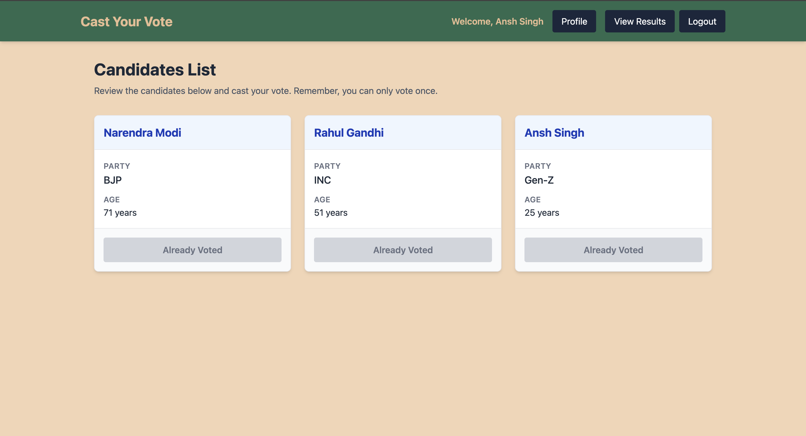

<div align="center">


<br/>


<a id="top"></a>

# 🗳️ Cast Your Vote

<div align="center">
  
</div>

<div align="center">
    
</div>
<br />

[](https://opensource.org/licenses/MIT)


</div>
<div align="center">
  <a href="https://cast-your-vote-jet.vercel.app/" target="_blank">
    
  </a>
  <h2><b><a href="https://cast-your-vote-jet.vercel.app/" target="_blank">✨ VIEW LIVE DEPLOYMENT ✨</a></b></h2>
  <p><i>Click the rocket to launch the live application!</i></p>
  <br />
</div>
<h2 id="-live-demo-access">
  
</h2>

> [!TIP]
> **Skip the registration!** You can test the live application immediately without creating a new account. Use the test credentials below to explore the different role-based features.

<div align="center">

| 🛡️ **Role** | 📧 **Aadhaar Number** | 🔐 **Password** | 🎯 **Capabilities** |
| :--- | :--- | :--- | :--- |
| **Admin Panel** | `123456789123` | `admin123` | Add/edit candidates, manage the portal, and view live election analytics. |
| **Voter Dashboard** | `987654321987` | `voter123` | Browse candidate manifestos, cast a secure vote, and view user profile. |

</div>
<br />
<h2 id="-quick-navigation">
  
</h2>

<div align="center">

| 📖 **Discover** | 🛠️ **Technical** | 🚀 **Execution** |
| :--- | :--- | :--- |
| 🎯 [About the Project](#-about-the-project) | ⚙️ [Tech Stack & Architecture](#️-tech-stack--architecture) | 💻 [Installation & Setup](#-installation--setup) |
| ✨ [Immersive Features](#-immersive-features) | 📂 [Project Architecture](#-project-architecture) | 📘 [Usage Guide](#-usage-guide) |
| 📸 [Visual Walkthrough](#-visual-walkthrough) | 🔐 [Environment Variables](#️-environment-variables) | 🤝 [Contributors](#-contributors) |

</div>
<br />


<h2 id="-about-the-project">
  
</h2>

**Cast Your Vote** is a robust MERN-stack web application designed to facilitate secure and transparent digital elections. Built with a focus on modern UI design and backend security, it features comprehensive role-based access control (RBAC), ensuring that administrators can seamlessly manage candidates and monitor elections, while voters can securely browse candidate profiles and cast their ballots without compromising data integrity.
<div align="center">

| 🎯 Mission | 💡 Vision | 🚀 Execution |
| :---: | :---: | :---: |
| To eliminate voter fraud through cryptographic security. | To make digital democracy accessible and transparent. | Built on a high-speed, scalable MERN architecture. |

</div>


<h2 id="-immersive-features">
  
</h2>

<table>
  <tr>
    <td width="50px"></td>
    <td><b>Secure Authentication:</b> JWT-based login and registration system with encrypted passwords.</td>
  </tr>
  <tr>
    <td></td>
    <td><b>Role-Based Access Control:</b> Distinct workflows and permissions for <code>Admin</code> and <code>Voter</code> roles.</td>
  </tr>
  <tr>
    <td></td>
    <td><b>Interactive Admin Panel:</b> Dedicated dashboard for administrators to add, update, and manage election candidates.</td>
  </tr>
  <tr>
    <td></td>
    <td><b>Real-Time Election Results:</b> Live tracking of vote counts and election outcomes.</td>
  </tr>
  <tr>
    <td></td>
    <td><b>User Profiles:</b> Personalized dashboards for voters to view their details and voting status.</td>
  </tr>
  <tr>
    <td></td>
    <td><b>High-Performance UI:</b> Lightning-fast frontend powered by React and Vite, with smooth state transitions handled by Redux Toolkit.</td>
  </tr>
  <tr>
    <td></td>
    <td><b>Scalable Architecture:</b> Modular backend structure utilizing standard API response/error handling utilities.</td>
  </tr>
</table>


<h2 id="-visual-walkthrough">
  
</h2>

| Voter Dashboard & Voting Interface | Admin Panel |
| :---: | :---: |
|<a href="frontend/public/ss1.png" target="_blank">  </a>|<a href="frontend/public/ss2.png" target="_blank"> </a> |

<br />

<div align="center">
  <b>Election Results</b><br/><br/>
  <a href="frontend/public/ss3.png" target="_blank">
  </a>
</div>


<h2 id="️-tech-stack--architecture">
  
</h2>

<div align="center">

| 🎨 **Frontend Development** | ⚙️ **Backend & Security** |
| :---: | :---: |
| <a href="https://skillicons.dev"></a> | <a href="https://skillicons.dev"></a> |
| **React.js** • **Vite**<br>**Redux Toolkit** • **Tailwind CSS** | **Node.js** • **Express.js**<br>**MongoDB** • **JWT Auth** |

</div>


<h2 id="-project-architecture">
  
</h2>

<details>
  <summary><b>Click to expand the folder structure</b></summary>

  ```text
  📦 cast-your-vote
  ┣ 📂 backend
  ┃ ┣ 📂 src
  ┃ ┃ ┣ 📂 controllers    # Business logic (candidates, users)
  ┃ ┃ ┣ 📂 middlewares    # JWT Auth protection
  ┃ ┃ ┣ 📂 models         # MongoDB schemas
  ┃ ┃ ┣ 📂 routes         # API endpoints
  ┃ ┃ ┗ 📜 app.js         # Express setup
  ┃ ┗ 📜 .env.sample      
  ┣ 📂 frontend
  ┃ ┣ 📂 src
  ┃ ┃ ┣ 📂 app            # Redux store setup
  ┃ ┃ ┣ 📂 features       # Redux slices (auth, candidates)
  ┃ ┃ ┣ 📂 pages          # Dashboard, Login, AdminPanel
  ┃ ┃ ┗ 📜 App.jsx        # Routing structure
  ┃ ┗ 📜 vite.config.js
  ┗ 📜 README.md
  ```
</details>
</br>

<h2 id="-installation--setup">
  
</h2>

Follow these instructions to get a local copy up and running.

### Prerequisites
* Node.js (v16+ recommended)
* MongoDB (Local instance or MongoDB Atlas cluster)
* Git

### Step-by-Step Installation

1. **Clone the repository**
   ```bash
   git clone https://github.com/anshsingh1032/cast-your-vote.git
   cd cast-your-vote
2. **Setup the Backend**

    ```bash
    cd backend
    npm install
    ```
    Create a .env file in the backend directory (see Environment Variables section below).
    ```bash
    npm run dev
3. **Setup the Frontend**

    Open a new terminal window/tab:

    ```bash
    cd frontend
    npm install
    npm run dev
4. **Access the application**
    ```bash
    Open your browser and navigate to http://localhost:5173.
<h2 id="-usage-guide">
  
</h2>

<table>
  <tr>
    <td width="70px" align="center"></td>
    <td><b>1. Register & Login:</b> Navigate to <code>/signup</code> to create a new voter account. Log in via <code>/login</code> to receive your secure session token.</td>
  </tr>
  <tr>
    <td width="70px" align="center"></td>
    <td><b>2. Explore Candidates:</b> Once authenticated, visit the Dashboard to view the list of participating candidates.</td>
  </tr>
  <tr>
    <td width="70px" align="center"></td>
    <td><b>3. Cast a Vote:</b> Select your preferred candidate and submit your vote.<br><i>(Note: A voter can only cast their ballot once).</i></td>
  </tr>
  <tr>
    <td width="70px" align="center"></td>
    <td><b>4. Admin Management:</b> If logged in as an Admin, navigate to the Admin Panel to add new candidates, update candidate details, or monitor the Election Results.</td>
  </tr>
</table>

<h2 id="️-environment-variables">
  
</h2>
To run this project, you will need to add the following environment variables to your .env file in the backend directory:

```bash
PORT=8000
MONGODB_URI=your_mongodb_connection_string

# JWT Configuration
ACCESS_TOKEN_SECRET=your_super_secret_access_token
ACCESS_TOKEN_EXPIRY=1d
```
<h2 id="-contributors">
  
</h2>

We welcome contributions! Here is how you can help make this project even better:
<div align="center">
<a href="https://github.com/anshsingh1032/cast-your-vote/graphs/contributors">
  
</a>
</div>

> **Want to contribute?** Check out our `CONTRIBUTING.md` guide or simply open a pull request!

**Fork the Project**

```bash 
Create your Feature Branch (git checkout -b feature/AmazingFeature)


Commit your Changes (git commit -m 'Add some AmazingFeature')

Push to the Branch (git push origin feature/AmazingFeature)

Open a Pull Request
```

## 📄 License
Distributed under the MIT License. See LICENSE for more information.

## 🙌 Acknowledgments
[Lucide React](https://lucide.dev/guide/react/) for UI iconography.

[Vite](https://vite.dev/) for the lightning-fast frontend tooling.

The open-source community for the robust MERN stack ecosystem.

## 📬 Contact
<div align="center">

***Ansh Singh** GitHub: [@anshsingh1032](https://github.com/anshsingh1032)

### Github Repo 

<a href="https://github.com/anshsingh1032/cast-your-vote"></a>


  
  
  

  <br /><br />

  <a href="#top">
    
    <br />
    <i>Back to Top</i>
  </a>
</div>

<div align="center">


### ⭐ If you like this project, drop a star!

💻 Built with passion by **<a href="https://github.com/anshsingh1032">Ansh Singh</a>**

</div>

